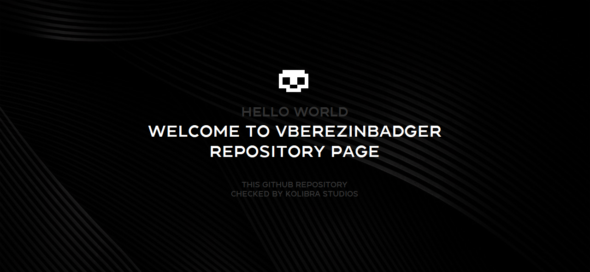

###  HELLO THERE

### 👋 Hi there

I am Vladimir Berezin. I develop all sorts of complex things: from simple applications and frameworks to grandiose projects. I have many interests and secrets.

### 📝 Interesting projects

 

<!-- BLOG-POST-LIST:START -->
- [FLEXengine](https://vk.com/kolibracorp.flexui)
- [BadgerOS](https://vk.com/kolibracorp.badgeros)
- [Hentai Terminal](https://vk.com/kolibracorp.hterminal)
- [Genesys Team](https://vk.com/genesys.team)
- [Genesys World](https://vk.com/genesys.world)
<!-- BLOG-POST-LIST:END -->

 

### 📌 Pinned comment

 
If you want to help me, then don't. I am self-taught and work alone, as well as in the circle of a large GuiseWare Team family.
 
