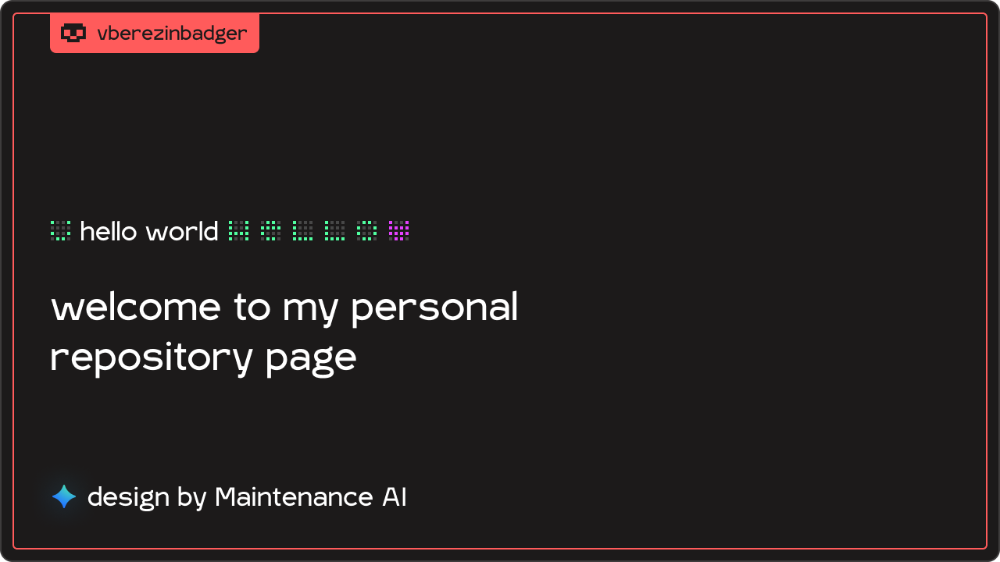

[Official site](https://vberezinbadger.github.io/)

#  Hello, world!

I am Vladimir Berezin. I develop all sorts of complex things: from simple applications and frameworks to grandiose projects. I have many interests and secrets.

#  Interesting projects

 

<!-- BLOG-POST-LIST:START -->
- [hbash](https://github.com/hentai-team/hbash)
- [Dino Game (on Python)](https://github.com/vberezinbadger/Chrome-Dino-Python)
- [mineCORE 4 Dev (for OpenComputers)](https://github.com/minesys/mineCORE-4)
- [mineCORE Release (for OpenComputers)](https://github.com/minesys/mineCORE)
<!-- BLOG-POST-LIST:END -->

 

#  Pinned comment

 
I'm Evilnyx, legendary developer and hackman.
 
